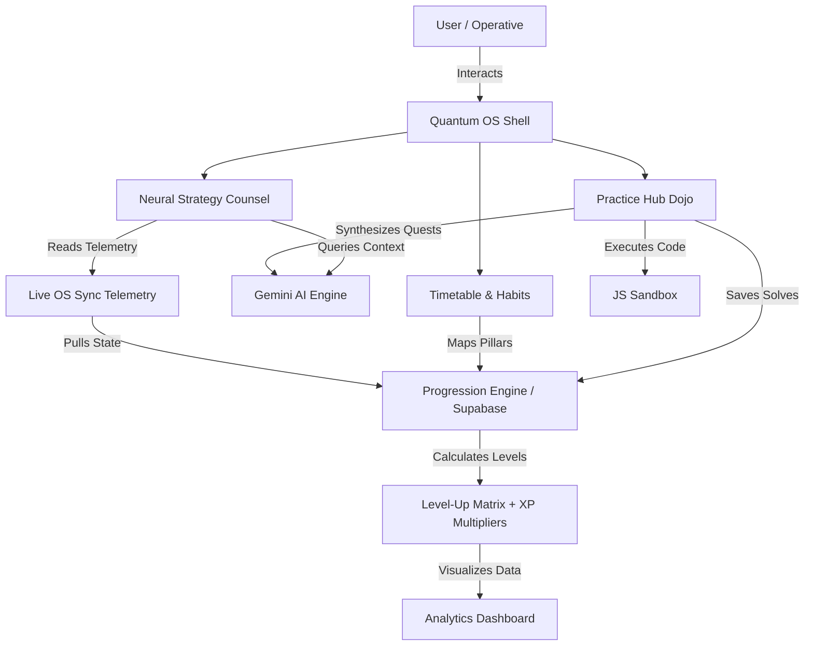

# 🌌 QUANTUM OS
### *The Cybernetic Life & Code Optimization System*

[](https://react.dev/)
[](https://www.typescriptlang.org/)
[](https://vite.dev/)
[](https://tailwindcss.com/)
[](https://supabase.com/)

---

## 🎯 The Mission

**Quantum OS** is a premium, gamified, cybernetic personal growth environment and developer dōjō. It is engineered to bridge the gap between technical code mastery and daily operational discipline. By translating your professional training (ABAP, Logic, Patterns, HR Leadership), schedules, financial habits, and physical routines into a unified **cybernetic telemetry dashboard**, Quantum OS gamifies your life progression. 

Whether you are optimizing rendering performance in the virtual dōjō, mapping out daily routines, or using AI to dissect productivity bottlenecks, Quantum OS acts as your digital neural sync.

---

> [!IMPORTANT]  
> **Quantum OS operates on render discipline.** The interface is built with highly responsive custom layouts, fluid canvas particle layers, sleek glassmorphism, precise audio responses, and advanced React performance patterns designed to keep your cognitive load light and your focus sharp.

---

## ⚡ Core Operational Hubs

````carousel
### 🧠 Neural Strategy Counsel
**Dynamic AI Growth Partner**
* **Live OS Sync Mode**: Toggle the cybernetic interface to automatically sync your live operating data (Study, Health, Finance, Mind levels, habit records, streaks, and schedules).
* **Deep Telemetry Analytics**: The AI counselor leverages the Gemini API to analyze your progression levels, identify weak links (e.g., lagging pillars), and construct bespoke real-world growth blueprints.
* **Responsive Command Center**: Optimized with a swiping preset directive deck for full accessibility on mobile and desktop viewports.
<!-- slide -->
### 🎯 Practice Hub (Protocol Dojo)
**High-Fidelity Coding Simulator**
* **70+ Built-in Challenges**: Master advanced concepts in ABAP Cloud (Steampunk RAP, Managed Numbering), Computer Science Logic (Knapsack, DFS, dynamic sorting), Pattern Architecture (Singleton, Observer, Decorator), and HR Leadership.
* **Daily Training (🎯 Daily)**: Instantly calibrates exactly **20 distinct quests** (5 Easy, 10 Medium, 5 Hard) tailored to today's date, featuring your custom *"Synaptic Flux Optimization"* react performance challenge at the top!
* **AI Dynamic Protocol Forge**: Input *any* tech stack or concept (e.g., `React hooks`, `SQL Joins`, `Redux Toolkit`) to instantly forge an immersive, custom coding quest.
* **Integrated JS Sandbox**: Compile and execute javascript algorithms directly inside a sandboxed browser workspace, returning live log telemetry.
* **Syndicate Synergy**: Solve all 20 daily protocols to unlock a massive **+200 XP Syndicate Synergy Bonus** accompanied by full canvas confetti triggers!
<!-- slide -->
### 📅 Dynamic Timetable Hub
**Cybernetic Resource Scheduler**
* **Pillar-Linked Time Blocks**: Map your daily tasks and routines directly to your core progression pillars (Study, Health, Finance, Mind).
* **Streak Tracking**: Maintain operational consistency and measure execution rates through reactive streaks.
<!-- slide -->
### 📈 Analytics & Progression Matrix
**High-Tech Telemetry Tracking**
* **Four-Dimensional Progression**: Earn experience points (XP) in Study, Health, Finance, and Mind to level up your avatar from *Novice* to *Scholar*, *Sage*, or *Master Mind*.
* **Lock-Excluding Cooldowns**: Protocols solved enter a strict 7-day calibration cooldown before allowing repeat solves, urging a balanced training regimen.
````

---

## 🛠️ The Cybernetic Tech Stack

Quantum OS is constructed using a high-performance modern tech stack designed for light page loads and instantaneous interactions:

* **Core Framework**: [React 19](https://react.dev/) + [Vite](https://vite.dev/)
* **Type Safety**: [TypeScript](https://www.typescriptlang.org/)
* **State & Hooks**: Context-driven telemetry loops with Custom Progression Hooks (`useProgression`)
* **Styling & UI**: Vanilla CSS + Tailwind v3 custom utility architecture
* **Animations**: [Framer Motion](https://www.framer.com/motion/) for premium transition feedback
* **Database & Auth**: [Supabase Client](https://supabase.com/) integration
* **Holographic AI Engine**: [Google Gemini Pro AI](https://deepmind.google/technologies/gemini/) (via Google Generative AI Services)
* **Feedback Assets**: Interactive [Canvas Confetti](https://www.npmjs.com/package/canvas-confetti) & premium spatial Audio Synthesizers

---

## 🚀 Setup & Local Deployment

Deploy Quantum OS in your local command center with these steps:

### 1. Prerequisite Verification
Ensure you have [Node.js](https://nodejs.org/) (v18+) and `npm` installed.

### 2. Clone and Initialize Workspace
```bash
# Navigate to workspace
cd your-workspace-directory

# Install dependency tree
npm install
```

### 3. Calibrate Environmental Matrices
Create a `.env.local` file at the root of the project to interface with databases and AI engines:

```env
# Google Gemini API Matrix
VITE_GEMINI_API_KEY=your_gemini_api_key_here

# Supabase Telemetry Database (Optional)
VITE_SUPABASE_URL=your_supabase_url
VITE_SUPABASE_ANON_KEY=your_supabase_anon_key
```

> [!TIP]
> If a database is not configured, Quantum OS will run in offline sandbox mode, automatically persisting all streaks, progression levels, dynamic protocols, and solves securely to the browser's `localStorage`!

### 4. Initiate Development Protocol
```bash
npm run dev
```
Open your console at the returned address (usually `http://localhost:5173`) to launch the workspace.

### 5. Compile Production Core
```bash
# Build & bundle optimized assets
npm run build

# Preview production build locally
npm run preview
```

---

## 🌌 Conceptual Architecture



---

## 👨‍💻 Render Discipline Guidelines

When modifying files in this repository, always align with the established architectural standards:
* **Visual Excellence**: Maintain the premium, dark-mode cybernetic theme. Avoid browser-default colors, using tailored translucent overlays, smooth color transitions, and subtle glowing borders instead.
* **Component Discipline**: Ensure child elements do not trigger unnecessary parent re-renders. When optimizing child lists, memoize props deeply and implement stable callback references using `useCallback` and `React.memo`.
* **Clean Codebases**: Retain existing docstrings, and double-check typing architectures to guarantee compilation builds return zero warnings.

---

### *Refactor the code. Calibrate the mind. Master the grid.*
